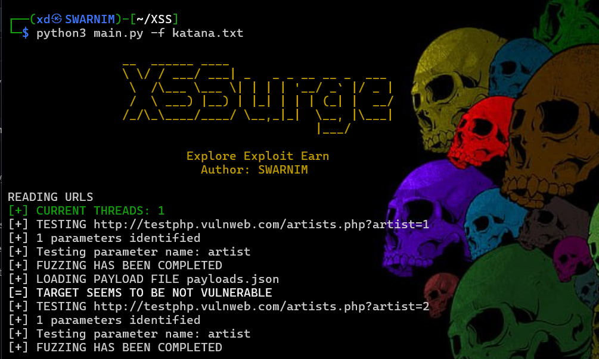

## XSSurge
Explore Exploit Earn



### FEATURES

- Flexible: Seamlessly incorporate your custom payloads with adder.py
- Responsive: The tool dynamically adjusts payloads according to the target's behavior.
- Expandable: Designed to efficiently scan numerous URLs simultaneously.
- Rapid: Sends multiple requests at once to enhance overall scanning efficiency.

### INSTALLATION (kali-linux)

```
(Note: To fully utilize this tool, please install Katana on your machine.)
1. Clone the repository: 
   git clone https://github.com/swarnimbandekar/XSSurge
2. Install the required dependencies: 
   pip3 install -r requirements
3. Execute the XSSurge.py file:
   python3 XSSurge.py
```

### USAGE
```
python3 XSSurge.py -f <filename> -o <output>

-f: Filename that contains bunch of links
-o: Output filename in which all the vulnerable endpoints is stored
-t: No of threads[Increase the threads if you want more speed] (Max: 10)
-u: Single URL to scan.
-H: Custom Headers.(PLease use , within "" to add multiple headers)
--crawl: Crawl the links first and then find xss

Using  multiple  headers:
python3 XSSurge.py -f urls.txt -H "Cookies:test=123;id=asdasd, User-Agent: Mozilla/Firefox" -t 7 -o result.txt

Using  single  header:
python3 XSSurge.py -f urls.txt -H "Cookies:test=123;id=asdasd" -t 7 -o result.txt

Scanning single URL:
python3 XSSurge.py -u http://example.com/hpp/?pp=12 -o out.txt

Detect waf & scan:
python3 XSSurge.py -u http://example.com/hpp/?pp=12 -o out.txt --waf

Specify waf manually:

python3 XSSurge.py -u http://example.com/hpp/?pp=12 -o out.txt -w cloudflare

Using PIPE

cat katana.txt | python3 main.py --pipe -t 7
```

